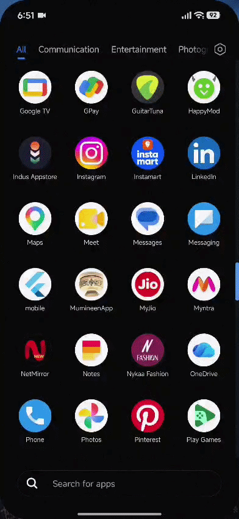

<div align="center">

# 🧠 NeuroAssist NER
### Next-Generation Cognitive Tracking & Predictive Caregiver Insights Platform

[](#-license)
[](https://fastapi.tiangolo.com/)
[](https://flutter.dev/)
[](https://deepmind.google/technologies/gemini/)
[](https://render.com/)
[](https://www.docker.com/)

<p align="center">
  <b>A production-grade, full-stack mobile and cloud ecosystem empowering cognitive monitoring through gamified telemetry, resilient offline synchronization, background anomaly detection, and predictive AI diagnostics.</b>
</p>

---

### 📹 Live Mobile App Demonstration



<br/><br/>

🎬 **[Click Here to Watch the Full High-Definition Demo Video (`video.mp4`)](assets/video.mp4)**

---

</div>

## 📌 Executive Summary

**NeuroAssist NER** bridges the critical gap between daily patient cognitive rehabilitation and actionable clinical oversight. Designed for individuals undergoing cognitive health tracking or neurological recovery, NeuroAssist records real-time interactive telemetry—including reaction times, memory retention accuracy, and error rates—via engaging mobile modules.

Built on an **offline-first paradigm**, the mobile client guarantees zero data loss in low-connectivity environments by maintaining a local event queue. Upon establishing a network connection, events automatically synchronize to an asynchronous **FastAPI** backend integrated with **Google Gemini 1.5 Flash**, delivering automated caregiver summaries, predictive trend analyses, and background alert triggers.

---

## ✨ Key Capabilities & Features

- **🎮 Gamified Cognitive Testing Suite:** Interactive modules (Memory Match, Reflex Tap / Reaction Time, Spatial Grid Matrix) capture precise quantitative performance metrics.
- **🔄 Resilient Offline Queue & Auto-Sync:** Stores session data locally when offline and seamlessly synchronizes queued events in batch payloads upon network restoration.
- **🧠 Predictive Generative AI Diagnostics:** Integrates Google Gemini 1.5 Flash to generate multi-paragraph predictive clinical reports analyzing multi-day trends, fatigue curves, and exercise recommendations.
- **⚡ Background Anomaly Evaluation:** Asynchronous worker tasks evaluate incoming metrics against clinical thresholds (e.g., reaction delays > 1500ms or high error spikes) to flag potential cognitive declines.
- **📊 Interactive Caregiver Dashboard:** Provides real-time data visualizers for daily score averages, error rates, and total session metrics.
- **🛡️ Enterprise Clinical Fallbacks:** Automated fallback engines ensure caregivers receive continuous diagnostic insights even during external API downtime or cold starts.

---

## 🏗️ System Architecture

```text
┌──────────────────────────────────────────────────────────┐
│                      Mobile Client                       │
│                   (Flutter / Dart App)                   │
│   • Interactive Cognitive Testing Modules                │
│   • Local SQLite / SharedPref Offline Queue              │
│   • Background Network State & Sync Engine               │
└────────────────────────────┬─────────────────────────────┘
                             │
                      HTTPS / REST API
                             │
                             ▼
┌──────────────────────────────────────────────────────────┐
│                      Cloud Backend                       │
│                     (FastAPI Engine)                     │
│   • CORS & Security Headers Middleware                   │
│   • Asynchronous SQLAlchemy ORM & SQLite Storage        │
│   • Background Worker Queue (Anomaly Evaluator)          │
└──────────────┬───────────────────────────┬───────────────┘
               │                           │
               ▼                           ▼
┌──────────────────────────────┐ ┌─────────────────────────┐
│  Google Gemini 1.5 Flash AI  │ │    Render Cloud Host    │
│  • Predictive Trend Engine   │ │  • Automated CI/CD      │
│  • Caregiver Summary Engine  │ │  • Production SSL/TLS   │
└──────────────────────────────┘ └─────────────────────────┘
```

---

## 🛠️ Technology Stack

| Tier | Technology | Purpose |
| :--- | :--- | :--- |
| **Mobile Frontend** | Flutter (Dart) | Cross-platform mobile client, UI state management, local database |
| **Backend Framework** | FastAPI (Python 3.10+) | High-performance asynchronous REST API backend |
| **Database & ORM** | SQLite & Async SQLAlchemy | Non-blocking database session management and event persistence |
| **Artificial Intelligence** | Google Gemini 1.5 Flash | Time-series data analysis, natural language summaries, insights |
| **Containerization** | Docker | Containerized build environment for consistent deployments |
| **Production Hosting** | Render | Cloud hosting service with automatic HTTPS TLS termination |

---

## 🚀 Quick Start Guide

### Prerequisites
- Flutter SDK (v3.10+)
- Python 3.10+
- Docker Desktop *(Optional)*
- Google Gemini API Key

### 1. Backend Service Setup
```bash
# Clone the repository
git clone https://github.com/your-username/neuroassist-ner.git
cd neuroassist-ner

# Create and activate Python virtual environment
python -m venv venv

# On Windows PowerShell:
.\venv\Scripts\activate
# On macOS / Linux:
source venv/bin/activate

# Install required dependencies
pip install -r requirements.txt

# Set environment variable for Gemini API
export GEMINI_API_KEY="your_gemini_api_key_here"

# Launch local API backend
uvicorn main:app --host 0.0.0.0 --port 8000 --reload
```

### 2. Mobile Client Setup
```bash
# Navigate to the mobile project directory
cd mobile

# Install Flutter package dependencies
flutter pub get

# Verify or update backend endpoint in lib/services/api_service.dart
# Set API_BASE_URL to https://neuroassist-ner-1.onrender.com or http://10.0.2.2:8000 for emulator

# Run application on connected physical device or emulator
flutter run

# Compile production-ready release APK
flutter build apk --split-per-abi
```

### 3. Docker Deployment Setup
Run the backend microservice inside a containerized Docker environment:
```bash
# Build Docker image
docker build -t neuroassist-backend .

# Run container with environment mapping
docker run -d -p 8000:8000 -e GEMINI_API_KEY="your_gemini_api_key_here" --name neuroassist_app neuroassist-backend
```

---

## 📡 Core API Endpoints Reference

| Method | Endpoint | Description |
| :--- | :--- | :--- |
| **GET** | `/` | Health check endpoint returning API operational status. |
| **POST** | `/api/sync` | Ingests offline event batches and triggers background anomaly evaluation. |
| **GET** | `/api/summary` | Generates a comforting 2-sentence patient summary for caregivers via Gemini AI. |
| **GET** | `/api/analytics/trends` | Aggregates time-series performance data into daily average score & error trends. |
| **GET** | `/api/ai/insights` | Generates a 3-paragraph predictive clinical trend report using Gemini AI. |
| **GET** | `/api/events` | Retrieves complete historical event sync logs from database. |

---

## 💡 Engineering Challenges & Key Solutions

Developing a real-time healthcare monitoring application introduced complex production challenges that were solved during implementation:

*   **Android Production Network Security (Release Builds):**
    *   *Challenge:* App synced successfully in Flutter Debug mode but returned `Backend Unreachable` in release APKs.
    *   *Solution:* Android restricts release APK network calls by default. Resolved by adding explicit `<uses-permission android:name="android.permission.INTERNET" />` declarations to `android/app/src/main/AndroidManifest.xml`.
*   **Cloud Cold Starts & Timeout Mitigations:**
    *   *Challenge:* Free cloud hosting instances enter a sleep state after inactivity, leading to HTTP 504 gateway timeouts on initial client sync payloads.
    *   *Solution:* Configured optimistic client-side UI resolution alongside a resilient exponential-backoff retry scheme within the mobile network sync engine.

---

## 📄 License

This project is licensed under the MIT License - see the [LICENSE](LICENSE) file for details.
